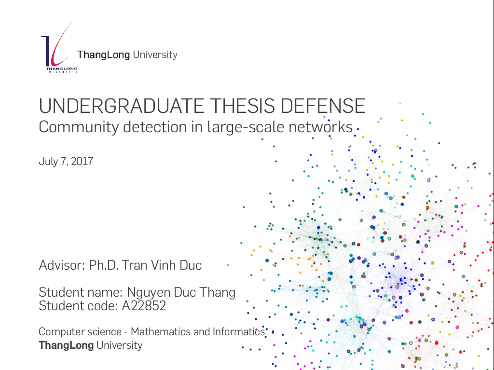

# BigCLAM-ApacheSpark
Overlapping community detection in Large-Scale Networks using BigCLAM model build on Apache Spark

Score: A+

In this thesis, I provide a general view of communities and its the real life applications. I introduce BigCLAM models proposed by Yang and Leskovec (2013), a popular model is used overlapping community detection algorithm. In particular, I proposed a few methods convex optimization and implemented BigCLAM in Apache Spark is evaluated as lightning-fast cluster computing to able detect community in the large-scale networks.

Contact:thangdn.tlu@outlook.com

Every comment would be appreciated.

If you want to use parts of any code of mine:

let me know and use it!
